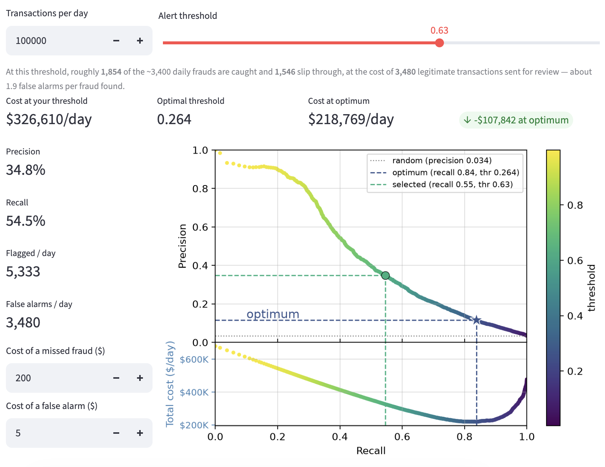

# Transaction Fraud Detection

Scoring card transactions for fraud risk, with a deployed API and an interactive dashboard
for exploring the alert-threshold trade-off.

**[Live dashboard](https://fraud-dashboard-wncx.onrender.com/)** · **[API docs](https://fraud-api-wbxh.onrender.com/)**

> Both services run on Render's free tier and sleep after inactivity — the first request
> may take 30–60 seconds to wake.

---

## The problem

Fraud is rare: about 3.4% of transactions in this dataset. That makes accuracy useless as a
metric (a model predicting "never fraud" scores 96.6%) and makes the interesting question
not *how good is the model* but *where do you set the alert threshold*.

Every threshold is a business decision:

| Threshold | Precision | Recall | False alarms per fraud caught |
|-----------|-----------|--------|-------------------------------|
| 0.30      | 13.3%     | 80.7%  | ~6.5                          |
| 0.50      | 24.0%     | 65.2%  | ~3.2                          |
| 0.70      | 42.0%     | 48.4%  | ~1.4                          |
| 0.90      | 79.4%     | 29.3%  | ~0.3                          |

Catch 80% of fraud and analysts review six legitimate transactions for every real one.
Keep the queue clean and two thirds of fraud goes through. The dashboard makes this
trade-off explicit, including a cost model that solves for the threshold minimising total
expected loss given assumed costs per missed fraud and per false alarm.



---

## Results

| Metric | Value | Note |
|--------|-------|------|
| Average Precision | **0.475** | ~14× the 0.034 baseline (fraud prevalence) |
| ROC-AUC | **0.894** | Time-based split |

**These are not comparable to Kaggle leaderboard scores.** The competition scored on
ROC-AUC against a separate held-out file 30 days in the future; this project validates on a
time-based split of the training data. Public solutions reported 0.92–0.96 ROC-AUC under
different conditions.

Average Precision is the metric that matters operationally here. At 3.4% prevalence,
ROC-AUC is inflated by how easy the negative class is — AP is bounded below by prevalence
and moves meaningfully when the model actually improves.

---

## What I found

**Removing leakage cost 0.04 ROC-AUC — and that was the point.**
An initial random train/test split scored 0.93. The same cards, devices, and users appear
across the full time range, so a random split lets the model see a card's later behaviour
while predicting its earlier transactions. Switching to a time-based split (train on
earlier transactions, test on later) dropped the score to 0.89. The lower number is the
honest one.

**Raw time features hurt under a time split.**
`TransactionDT` is a monotonic offset, so every test value exceeds the training maximum and
trees can't extrapolate. Replaced with cyclical features (time of day, day of week) derived
from it.

**Three rounds of feature engineering produced no measurable lift.**
Per-card aggregates, transaction amount relative to a card's running mean, and time since a
card's previous transaction all left AP unchanged (0.481 → 0.473 → 0.475 — within
run-to-run noise on a single split). The most likely explanation is that the dataset's
provided `V` columns, engineered by Vesta from the same raw transactions, already encode
per-card behaviour. AP staying stable across substantially different feature sets suggests
the model is signal-limited rather than feature-limited.

Reporting this rather than quietly dropping it: a null result that's understood is more
useful than an unexplained improvement.

---

## Architecture

```
├── notebooks/           EDA, feature engineering, model training
├── models/              Serialised bundle: pipeline, feature order,
│                        category levels, PR curve, metrics
├── app/
│   ├── api/             FastAPI service
│   └── dashboard/       Streamlit multi-page app (API client only)
└── Dockerfile           Shared image; two Render services differ by start command
```

The model, scaler, and preprocessing live in a single scikit-learn `Pipeline`, serialised
together with the exact feature order and categorical levels used at training time. The API
reconstructs an identically-shaped frame from every request, which eliminates the
train/serve skew that otherwise creeps into deployed models.

The dashboard holds no model — it calls the API over HTTP, so there's one source of truth
for scoring.

### API endpoints

| Endpoint | Purpose |
|----------|---------|
| `GET /health` | Liveness |
| `GET /model-info` | Metrics, feature set, training date |
| `GET /thresholds` | Precision-recall curve for plotting |
| `GET /threshold-for` | Solve for a threshold given target precision or recall |
| `POST /predict` | Score one transaction |
| `POST /predict-batch` | Score many |
| `POST /evaluate` | Metrics on labelled data — supports monitoring for drift |

`/evaluate` builds a precision-recall curve from the caller's own data rather than reusing
the training curve, so the gap between a requested precision and the achieved one is a
direct read on whether performance still holds.

---

## Running locally

```bash
pip install -r requirements.txt

# terminal 1
uvicorn app.api.main:app --reload --port 8000

# terminal 2
streamlit run app/dashboard/home.py
```

Dashboard at `localhost:8501`, API docs at `localhost:8000/docs`. The dashboard reads
`API_URL` from the environment, defaulting to `http://localhost:8000`.

---

## Data

[IEEE-CIS Fraud Detection](https://www.kaggle.com/c/ieee-fraud-detection) — ~590,000
transactions with 434 anonymised features contributed by Vesta Corporation.

The identifiers are hashed and nothing here re-identifies an individual. Worth noting that
the same techniques applied to production data amount to per-customer behavioural
profiling, which is a real model-governance consideration in a deployed fraud system.

---

## Stack

Python · XGBoost · scikit-learn · pandas · FastAPI · Pydantic · Streamlit · Docker · Render
